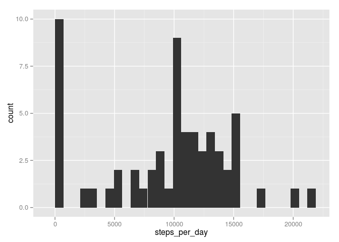
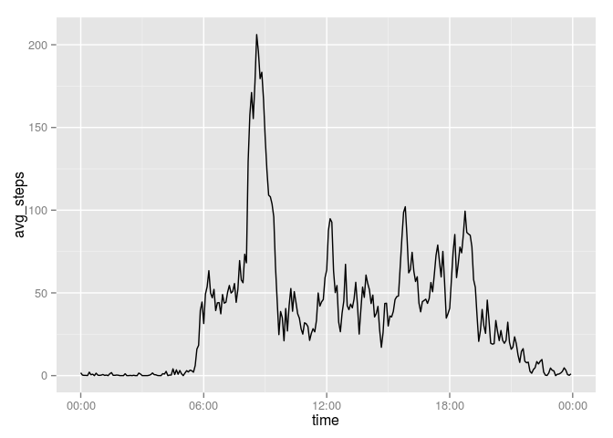
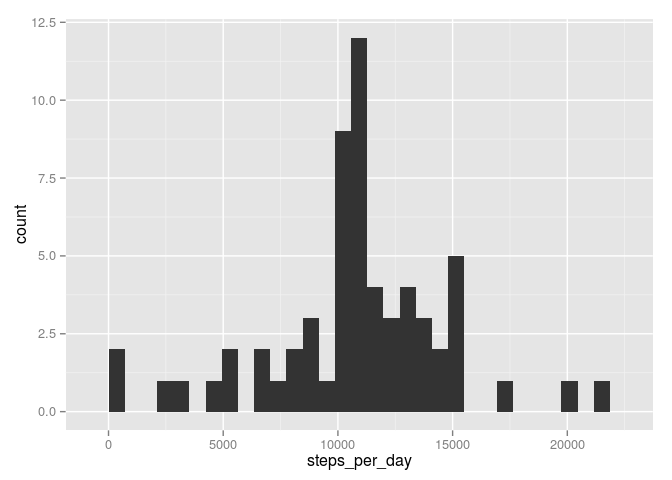
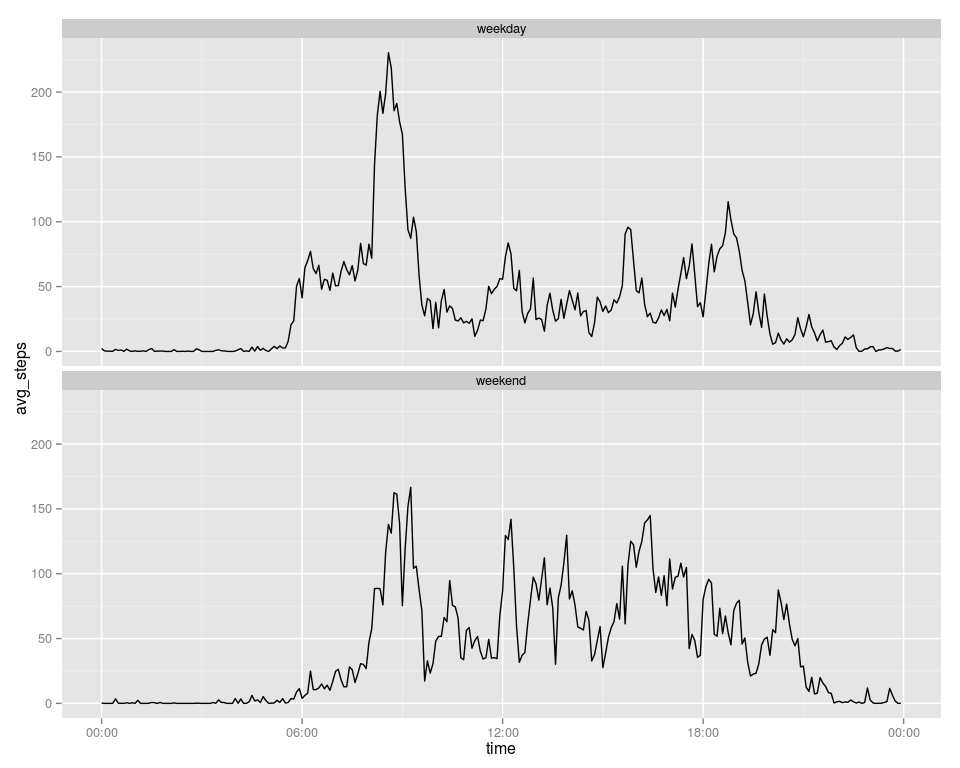

# Reproducible Research: Peer Assessment 1


## Loading and preprocessing the data
Load the data, unzipping it in-place. Convert date column into proper 
POSIXct type, parse the interval column as time, and combine date and time 
into timestamp.

```r
library(dplyr)
```

```
## 
## Attaching package: 'dplyr'
## 
## The following object is masked from 'package:stats':
## 
##     filter
## 
## The following objects are masked from 'package:base':
## 
##     intersect, setdiff, setequal, union
```

```r
library(lubridate)

data <- read.table(unz("activity.zip", "activity.csv"), 
                   header=TRUE, 
                   na.strings="NA", 
                   sep=",", 
                   as.is = TRUE)

# convert interval column to time and combine it with date column into timestamp
data <- data %>% mutate(date=ymd(date),
                        time=sprintf("%04d", interval), # add zero padding up to a width of 4
                        time=sub("(\\d{2})(\\d{2})", "\\1:\\2", time), # insert ":" between hours and minutes
                        timestamp=date + hm(time)) # convert to timestamp
str(data)
```

```
## 'data.frame':	17568 obs. of  5 variables:
##  $ steps    : int  NA NA NA NA NA NA NA NA NA NA ...
##  $ date     : POSIXct, format: "2012-10-01" "2012-10-01" ...
##  $ interval : int  0 5 10 15 20 25 30 35 40 45 ...
##  $ time     : chr  "00:00" "00:05" "00:10" "00:15" ...
##  $ timestamp: POSIXct, format: "2012-10-01 00:00:00" "2012-10-01 00:05:00" ...
```


## What is mean total number of steps taken per day?
Let's group the data by date, calculate the sum of steps in each interval per group 
and plot a histogram.

```r
library(ggplot2)
daily_data <- data %>% group_by(date) %>% summarise(steps_per_day=sum(steps, na.rm=TRUE))
ggplot(data=daily_data, aes(steps_per_day)) + geom_histogram()
```

 

```r
mean_total_steps <- mean(daily_data$steps_per_day, na.rm=TRUE)
median_total_steps <- median(daily_data$steps_per_day, na.rm=TRUE)
```
The *mean* of the total steps per day is **9354.2295082**.
The *median* of the total steps per day is **10395**.


## What is the average daily activity pattern?

To get a correct time-series plot we need to convert the interval column to proper
datetimes. Otherwise there would be "jumps" at the end of the hours; i.e. from 
1055 to 1100. Numerically the gap is 45, but time-wise it's only 5 minutes.

We do this by assigning the time to a single date (2015-09-20) and omitting
the date part in the axis labels.

```r
library(scales) # for date_format function
interval_data <- data %>% group_by(time) %>%
                      summarise(avg_steps=mean(steps, na.rm=TRUE)) %>%
                      mutate(time=ymd("2015-09-20") + hm(time))
ggplot(interval_data, aes(time, avg_steps)) + geom_line() + scale_x_datetime(labels = date_format("%H:%M"))
```

 

Let's find the index which contains the maximum average number of steps in an interval and obtain the
interval's corresponding start and end time.

```r
max_ind <- which.max(interval_data$avg_steps)
start_time <- strftime(interval_data[[max_ind, "time"]], "%H:%M", tz="UTC") 
start_time
```

```
## [1] "08:35"
```

```r
end_time <- strftime(interval_data[[max_ind+1, "time"]], "%H:%M", tz="UTC") 
end_time
```

```
## [1] "08:40"
```

The maximum number of steps accros all days occurs in the interval from **08:35–08:40**.

## Imputing missing values

```r
num_NAs <- sum(is.na(data))
num_NAs
```

```
## [1] 2304
```
There are **2304 missing values** in the dataset.

To fill in these missing values we use the mean for the corresponding time period.


```r
avg_by_interval <- data %>% group_by(interval) %>% summarise(avg_steps=mean(steps, na.rm=TRUE))

# create a list with the same length as data and substitute with either the average of 
# the corresponding time period (if number of steps is NA) or with the given
# number of steps if the value is not NA. 
# The trick is that the avg_by_interval vector is reused if it is too short. Since
# every day has exctly 288 5-minute intervals, this works as expected.
imp_steps <- ifelse(is.na(data$steps), avg_by_interval$avg_steps, data$steps)

# show that there are no NAs anymore
sum(is.na(data$imp_steps))
```

```
## Warning in is.na(data$imp_steps): is.na() applied to non-(list or vector)
## of type 'NULL'
```

```
## [1] 0
```

```r
# column bind both
data <- cbind(data, imp_steps)
```

Let's group the data by date, calculate the sum of steps in each interval per group 
and plot a histogram.

```r
daily_data_v2 <- data %>% group_by(date) %>% summarise(steps_per_day=sum(imp_steps, na.rm=TRUE))
ggplot(data=daily_data_v2, aes(steps_per_day)) + geom_histogram()
```

 

```r
mean_total_steps_v2 <- mean(daily_data_v2$steps_per_day, na.rm=TRUE)
median_total_steps_v2 <- median(daily_data_v2$steps_per_day, na.rm=TRUE)
```

The *mean* of the total steps per day is **1.0766189\times 10^{4}**.
The *median* of the total steps per day is **1.0766189\times 10^{4}**.

Mean and median values are now identical. Mean value is higher than before, because
NAs got substiuted with the average of the corresponding interval over all days.

## Are there differences in activity patterns between weekdays and weekends?


```r
# make sure the day of week labels appear in English
Sys.setlocale(category="LC_TIME", locale="en_US.UTF-8")
```

```
## [1] "en_US.UTF-8"
```

```r
# create a factor variable for weekend/weekda   y
data <- data %>% mutate(weekend=factor(weekdays(data$timestamp, abbreviate = TRUE) %in% c("Sat","Sun"), levels=c(FALSE, TRUE), labels=c("weekday", "weekend")))

weekend_data <- data %>% group_by(weekend, time) %>%
                      summarise(avg_steps=mean(steps, na.rm=TRUE)) %>%
                      mutate(time=ymd("2015-09-20") + hm(time))
ggplot(weekend_data, aes(time, avg_steps)) + 
    geom_line() + 
    facet_wrap(~weekend, ncol=1) +
    scale_x_datetime(labels = date_format("%H:%M"))
```

 

As can be seen, on average activity on weekends starts later and ends later. The
peek at 8:30 on weekdays seems to be the daily commute to work.
